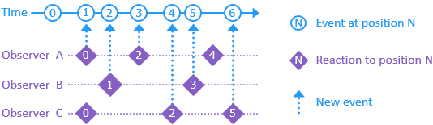

###  Totem

A framework for building timeline-based applications on .NET Core

[Introduction](#introduction)

[Packages](#packages)

[License](#license)

[Getting Started](#getting-started)

[Help & Support](#help-support)

[Concepts](#concepts)

[Testing](#testing)

[Background](#background)

# Introduction

Totem organizes software as a timeline - a series of events flowing to interested observers. Each event occupies a distinct position in history and captures the circumstances of a decision. Observers work through events that interest them, at their own paces, absorbing information and appending new ones:



This is the heart of [knowledge work](https://en.wikipedia.org/wiki/Knowledge_worker): individuals making and reacting to decisions. Over time, observers develop unique pasts that inform their work, just as people do. Knowledge arises from the cycle, embodied by events and available for future consideration.

Totem provides an environment for these interactions. Applications define events, observers, and reactions. A framework built on .NET Core hosts the timeline, implementing delivery, persistence, and communication. The result is software that works similarly to those who write and use it.

## Purpose

People were doing knowledge work long before computers. We innately understand it, yet software does not. Modern systems lean heavily on spatial metaphors, a departure from the time-oriented, story-driven nature of human activity. This can make software seem arcane and unapproachable, impacting effectiveness and goodwill.

Totem addresses the discord by framing work as a narrative, closer to how we communicate and learn, in hopes of making software more useful and accessible.

It strives to make storytelling the most valuable skill of software authors.

## Goals

**Repeatable solutions**
<br/>Establish an application model with implementation guidance.

**Batteries included**
<br/>Configure the timeline with sensible defaults and support overrides.

**Idiomatic .NET Core**
<br/>Leverage existing skills wherever possible.

**Business intelligence**
<br/>Capture data that can answer compelling future questions.

**Stable concept count**
<br/>Keep the timeline easy to describe, reason about, and use.

# License

Totem is under the [MIT License](license.txt). Like knowledge, it wants to be free.

# Packages

This is a [monorepo](https://en.wikipedia.org/wiki/Monorepo) containing the Totem stack. Each project has a corresponding NuGet package.

| Project | Description
|-|-
| [Totem](https://www.nuget.org/packages/Totem) | A collection of tools for common development scenarios in .NET
| [Totem.Runtime](https://www.nuget.org/packages/Totem.Runtime) | A collection of tools for working in the .NET runtime
| [Totem.Timeline](https://www.nuget.org/packages/Totem.Timeline) | The core elements and machinery of the timeline
| [Totem.Timeline.EventStore](https://www.nuget.org/packages/Totem.Timeline.EventStore) | Persistence for the timeline in an [EventStore](https://eventstore.org/) database
| [Totem.Timeline.Mvc](https://www.nuget.org/packages/Totem.Timeline.Mvc) | An [ASP.NET Core MVC](https://docs.microsoft.com/en-us/aspnet/core/mvc/overview?view=aspnetcore-2.2) server connected to the timeline
| [Totem.Timeline.SignalR](https://www.nuget.org/packages/Totem.Timeline.SignalR) | An [ASP.NET Core SignalR](https://docs.microsoft.com/en-us/aspnet/core/signalr/introduction?view=aspnetcore-2.2) server connected to the timeline
| [Totem.App.Service](https://www.nuget.org/packages/Totem.App.Service) | A base configuration for service applications, including the timeline, [EventStore](https://eventstore.org/), and [Serilog](https://serilog.net/)
| [Totem.App.Tests](https://www.nuget.org/packages/Totem.App.Tests) | A base configuration for testing applications, including an in-memory timeline and support for any test framework
| [Totem.App.Web](https://www.nuget.org/packages/Totem.App.Web) | A base configuration for web applications, including the timeline, [EventStore](https://eventstore.org/), [Serilog](https://serilog.net/), and [ASP.NET Core MVC](https://docs.microsoft.com/en-us/aspnet/core/mvc/overview?view=aspnetcore-2.2) + [SignalR](https://docs.microsoft.com/en-us/aspnet/core/signalr/introduction?view=aspnetcore-2.2)

*NOTE: Versions are prerelease until some internal systems are vetted in production for a bit longer.*

# Getting Started

*[under construction] This will describe how to create a timeline solution from a template via `dotnet new`. See the [App](#app) section for a description of solution structure. Example apps are also in the works.*

# Help & Support

Questions and feedback are welcome in the [#totem](https://ddd-cqrs-es.slack.com/channels/totem) channel of the [ddd-cqrs-es slack](https://t.co/MRxpx0rLH2).

<sup><sub>NOTE: There are a lot of decisions to make in a framework like this. No one could possibly like them all (even the authors). Please assume the competence and best intentions of those behind Totem.</sub></sup>

# Concepts

[Event](#event)
<br/>[Command](#command)
<br/>[Query](#query)
<br/>[Topic](#topic)
<br/>[Route](#route)
<br/>[Area](#area)
<br/>[App](#app)

## Event

An event is a signal on the timeline of an environment. It captures the context of a decision made in the past:

```csharp
using Totem.Timeline;

namespace Acme.ProductImport
{
  public class ImportStarted : Event
  {
    public ImportStarted(string reason)
    {
      Reason = reason;
    }
    
    public readonly string Reason;
  }
}
```

Here, the system decided conditions were right to start an import for the specified reason.

Events have past-tense names representing facts about the environment.

## Command

A command is an event* that awaits an outcome after occurring:
<br/><sup><sub>* This may rankle some. Please suspend disbelief initially.</sup></sub>

```csharp
using Totem.Timeline;

namespace Acme.ProductImport
{
  public class StartImport : Command
  {
    public StartImport(string reason)
    {
      Reason = reason;
    }
    
    public readonly string Reason;
  }
}
```

Here, a person or external system decided an import needed starting, for the specified reason, and made it so.

Commands have imperative names representing instructions to the environment.

## Query

A query is an observer that tallies events into a data structure:

```csharp
using Totem.Timeline;

namespace Acme.ProductImport.Queries
{
  public class ImportStatus : Query
  {
    public bool Importing;
    public string Reason;
    public string Error;
    
    void Given(ImportStarted e)
    {
      Importing = true;
      Reason = e.Reason;
      Error = null;
    }
    
    void Given(ImportFinished e)
    {
      Importing = false;
    }
      
    void Given(ImportFailed e)
    {
      Importing = false;
      Error = e.Error;
    }
  }
}
```

The `Given` methods signal interest in those event types. The timeline calls them in order, fully completing one before moving onto the next. 

Queries remember where they left off, allowing them to resume after restarts.

They also support a subscription model particularly suited to reactive UIs.

## Topic

A topic is an observer that adds events to the timeline. Like queries, it maintains state via `Given` methods and remembers where it left off. However, it also supports `When` methods that make decisions:

```csharp
using Totem.Timeline;

namespace Acme.ProductImport.Topics
{
  public class ImportProcess : Topic
  {
    bool _importing;
    
    void Given(ImportStarted e) =>
      _importing = true;
      
    void Given(ImportFinished e) =>
      _importing = false;
      
    void When(StartImport e)
    {
      if(_importing)
      {
        Then(new ImportAlreadyStarted());
      }
      else
      {
        Then(new ImportStarted(e.Reason));
      }
    }
  }
}
```

A first `StartImport` will result in `ImportStarted`. That becomes a new timeline position, which goes to the `Given` for it and sets the flag to true. Any further `StartImport`s will result in `ImportAlreadyStarted`, until `ImportFinished` happens and sets the flag back to false.

All events sent to `Then` go to the timeline *after* `When` completes, with the cause set to the current position.

A topic may have any combination of `Given` and `When` methods for events. If both are present for the same event, `Given` runs first so `When` can see the new state.

### Scheduling events in the future

`When` methods can also emit future events. Here, `ImportProcess` schedules an import for the next day, while allowing manual imports in the meantime:

```csharp
using Totem.Timeline;

namespace Acme.ProductImport.Topics
{
  public class ImportProcess : Topic
  {
    bool _importing;
    bool _importScheduled;
    
    void Given(ImportStarted e) =>
      _importing = true;
    
    void Given(ImportFinished e) =>
      _importing = false;
      
    void GivenScheduled(StartScheduledImport e) =>
      _importScheduled = true;
      
    void Given(StartScheduledImport e) =>
      _importScheduled = false;
      
    //
    // When
    //
      
    void When(StartImport e)
    {
      if(_importing)
      {
        Then(new ImportAlreadyStarted());
      }
      else
      {
        Then(new ImportStarted(e.Reason));
      }
    }
      
    void When(StartScheduledImport e)
    {
      if(_importing)
      {
        Then(new ImportAlreadyStarted());
      }
      else
      {
        Then(new ImportStarted("Scheduled"));
      }
    }
    
    void When(ImportFinished e)
    {
      if(!_importScheduled)
      {
        var nextOccurrence = Clock.Now.AddMinutes(10);
        
        ThenSchedule.At(new StartScheduledImport(), nextOccurrence);
      }
    }
  }
}
```

A key detail is `GivenScheduled`, which happens when the event is scheduled, not when it occurs. (`WhenScheduled` is also available.)

The `ThenSchedule` property is designed for extension methods. `.At` takes an explicit time; other useful ones include `.NextInterval` ("every 4 hours") and `.NextTimeOfDay` ("every day at 10pm and 4am").

### Interacting with the world

Topics act *in the now*, making them ideal for working with other systems:

```csharp
using Acme.ProductImport.Data;
using Totem.Timeline;

namespace Acme.ProductImport.Topics
{
  public class ImportSteps : Topic
  {
    readonly ProductList _products = new ProductList();
    
    void Given(ProductsDiffed e) =>
      _products.ApplyDiff(e.Diff);
    
    async Task When(ImportStarted e, IProductFile file)
    {
      try
      {
        var diff = await file.DiffProducts(_products);
        
        Then(new ProductsDiffed(diff));
      }
      catch(Exception error)
      {
        Then(new ImportFailed(error.ToString()));
      }
    }
    
    async Task When(ProductsDiffed e, IProductDb db)
    {
      try
      {
        await db.SyncProducts(_products);
        
        Then(new ImportFinished());
      }
      catch(Exception error)
      {
        Then(new ImportFailed(error.ToString()));
      }
    }
  }
}
```

`When` methods support asynchronous code; topics do not move to the next event until the `Task` completes.

They also declare dependencies as parameters (see [App](#app) for details). `IProductFile` and `IProductDb` do the heavy lifting, leaving the topic to orchestrate the work.

`ImportSteps` is separate so that `ImportProcess` can still respond to commands. Each topic is a team member specializing in a set of decisions.

## Route

The query and topic types above each have a single instance on the timeline, which observes all events.

Both types can also have multiple instances, distinguished by an identifier. Static methods select which instances observe an event:

```csharp
using Totem;
using Totem.Timeline;

namespace Acme.ProductImport.Queries
{
  public class ProductDetails : Query
  {
    static Many<Id> RouteFirst(ProductsDiffed e) => e.Diff.Ids;
    static Id Route(ProductIncluded e) => e.ProductId;
    static Id Route(ProductExcluded e) => e.ProductId;
    
    public string Name;
    public string ImageUrl;
    public decimal Price;
    public bool IsIncluded;
    
    void Given(ProductsDiffed e)
    {
      if(e.Diff.RemovedIds.Contains(Id))
      {
        ThenDone();
      }
      else
      {
        var product = e.Diff[Id];
      
        Name = product.Name;
        ImageUrl = product.ImageUrl;
        Price = product.Price;
      }
    }
      
    void Given(ProductIncluded e) =>
      IsIncluded = true;
      
    void Given(ProductExcluded e) =>
      IsIncluded = false;
  }
}
```

`Route` skips instances that do not yet exist, whereas `RouteFirst` creates them. They can return `Id` or anything implementing `IEnumerable<Id>`, which sets the `.Id` property on the corresponding instance.

 `ThenDone` indicates the end of an instance's lifetime.

## Area

An area is a family of events, queries, and topics on the same timeline. It forms a boundary for the concepts and language within, exposing well-defined inputs and outputs.

The primary difference between areas is the decisions they own. Like teams in a company, they are focused parts of a larger whole. Each area is responsible for a portion of the domain.

This partitioning of work leads to more communication. Areas have several integration strategies, generally dependent on how well they know each other. Topics make these touchpoints explicit concerns.
    
## App

An app configures an area for hosting by the framework. It produces two components: a service to host the timeline, and an optional web server. Both reference a core project containing the area's events, queries, and topics*:

```
Acme.ProductImport.sln
  Acme.ProductImport
  Acme.ProductImport.Service
  Acme.ProductImport.Web
```
<sup><sub>* This is not strictly required, though the Totem experience is quite smooth with it.</sup></sub>

The core project declares a marker type:

```csharp
using Totem.Timeline.Hosting;

namespace Acme.ProductImport
{
  public class ProductImportArea : TimelineArea
  {}
}
```

The service project runs the queries and topics in the marker type's assembly. It also declares dependencies available to topics:

```csharp
using System.Threading.Tasks;
using Totem.App.Service;

namespace Acme.ProductImport.Service
{
  public static class Program
  {
    public static Task Main() =>
      ServiceApp.Run<ProductImportArea>(services => services.AddProductImport());
  }
}
```

The web project runs a client that interacts with the timeline service:

```csharp
using System.Threading.Tasks;
using Totem.App.Web;

namespace Acme.ProductImport.Web
{
  public static class Program
  {
    public static Task Main() => WebApp.Run<ProductImportArea>();
  }
}
```

It issues commands for `POST`/`PUT`/`DELETE`/etc, then waits for events in response. It also `GET`s query state and supports subscriptions via WebSockets.

### Reading queries with `GET`:

```csharp
using System.Threading.Tasks;
using Acme.ProductImport.Queries;
using Microsoft.AspNetCore.Mvc;
using Totem.Timeline.Mvc;

namespace Acme.ProductImport.Web.Controllers
{
  public class ImportsController : Controller
  {
    [HttpGet("/api/imports")]
    public Task<IActionResult> GetStatus([FromServices] IQueryServer queries) =>
      queries.Get<ImportStatus>();
  }
}
```

Responses include the query's version as an `ETag` header. Its value is the last observed timeline position. This tells HTTP caching that the content of a specific version is immutable.

### Issuing commands with `POST`/`PUT`/`DELETE`/etc:

```csharp
using System.Threading.Tasks;
using Microsoft.AspNetCore.Mvc;
using Totem.Timeline.Mvc;

namespace Acme.ProductImport.Web.Controllers
{
  public class ImportsController : Controller
  {
    [HttpPost("/api/imports")]
    public Task<IActionResult> StartImport([FromServices] ICommandServer commands) =>
      commands.Execute(
        new StartImport(),
        When<ImportStarted>.ThenOk,
        When<ImportAlreadyStarted>.ThenConflict);
  }
}
```

The command goes on the timeline, where a topic handles it. The command's identifier flows to any new events, allowing the server to correlate them with pending requests to determine responses.

*That's it for concepts!*

# Testing

`Totem.App.Tests` supports automated testing of queries and topics. Each test spins up a full .NET Core app hosting an in-memory timeline. This isolation lets tests run in parallel without issue.

Timeline tests focus on a single query or topic type, ignoring everything else. Test classes derive from `QueryTests<>` or `TopicTests<>` and specify the tested type. Each has a small API to interact with the timeline.

<sup><sub>NOTE: These classes currently run under xUnit only, as they use the constructor and `IDisposable` to start and stop the timeline. Shims to other frameworks should be straightforward.</sup></sub>

### Queries

To declare tests for the [`ImportStatus`](#query) query (above):

```csharp
using Acme.ProductImport.Queries;
using Totem.App.Tests;

public class ImportStatusTests : QueryTests<ImportStatus>
{
  ...
}
```

Testing a query involves two methods:

1. `Append(Event)` puts events on the timeline to observe.
2. `GetQuery()` returns query data after observing all appended events.

For example, to test how [`ImportStatus`](#query) reacts to the import starting:

```csharp
[Fact]
public async Task ImportStarted()
{
  var reason = "Testing";

  await Append(new ImportStarted(reason));

  var query = await GetQuery();

  Expect(query.Importing).IsTrue();
  Expect(query.Reason).Is(reason);
  Expect(query.Error).IsNull();
}
```

To test how [`ImportStatus`](#query) reacts to the import finishing:

```csharp
[Fact]
public async Task ImportFinished()
{
  await Append(new ImportStarted());
  await Append(new ImportFinished());

  var query = await GetQuery();

  Expect(query.Importing).IsFalse();
}
```

Finally, to test how [`ImportStatus`](#query) reacts to the import failing:

```csharp
[Fact]
public async Task ImportFailed()
{
  var error = "Error";

  await Append(new ImportStarted());
  await Append(new ImportFailed(error));

  var query = await GetQuery();

  Expect(query.Importing).IsFalse();
  Expect(query.Error).Is(error);
}
```

<sup><sub>NOTE: The `Expect` syntax is available by default, but any assertion library will work.</sup></sub>

### Topics

Declaring tests for the [`ImportProcess`](#topic) topic (above):

```csharp
using Acme.ProductImport.Topics;
using Totem.App.Tests;

public class ImportProcessTests : TopicTests<ImportProcess>
{
  ...
}
```

Testing a topic involves two methods and a property:

1. `Append(Event)` puts events on the timeline to observe.
2. `Expect<TEvent>` gets the next event and asserts it is the specified type.
3. `Services` allows registration of fake objects available to `When` methods.

For example, to test how [`ImportProcess`](#topic) decides to start the import:

```csharp
[Fact]
public async Task Start()
{
  await Append(new StartImport());

  await Expect<ImportStarted>();
}
```

To test how [`ImportProcess`](#topic) decides to handle overlapping imports:

```csharp
[Fact]
public async Task StartTwice()
{
  await Append(new StartImport());

  await Expect<ImportStarted>();

  await Append(new StartImport());

  await Expect<ImportAlreadyStarted>();
}
```

#### Dependencies

Topics such as [`ImportSteps`](#interacting-with-the-world) (above) declare dependences in `When` methods. These seams fake the outside world to provide data to the tests:

```csharp
[Fact]
public async Task DiffProducts()
{
  Services.AddSingleton<IProductFile, FakeProductFile>();
  
  await Append(new ImportStarted());
  
  var diffed = await Expect<ProductsDiffed>();
  
  Expect(diffed.AddedProducts.Count).Is(1);
}

[Fact]
public async Task DiffProductsError()
{
  Services.AddSingleton<IProductFile, ErrorProductFile>();
  
  await Append(new ImportStarted());
  
  await Expect<ImportFailed>();
}
```

This works with any library that produces fakes/mocks/stubs/etc.

# Background

Totem is a synthesis of various design paradigms in contemporary software, including:

* [Domain-Driven Design](http://en.wikipedia.org/wiki/Domain-driven_design)
* [Command Query Responsibility Segregation (CQRS)](http://martinfowler.com/bliki/CQRS.html)
* [Event Sourcing](http://martinfowler.com/eaaDev/EventSourcing.html)
* [Actor Model](https://en.wikipedia.org/wiki/Actor_model)
* [Microservices](https://en.wikipedia.org/wiki/Microservices)
* [Event Storming](https://www.eventstorming.com/)

The ideas and lessons of these approaches greatly influence the timeline. They address the dynamics of collaboration and provide insight into how knowledge evolves. People are the most complex aspect of software, something each discipline embraces in its own way.

Totem grew up at [DealerOn](http://www.dealeron.com/) and powers several of its critical systems.

*The logo is the spinning top from [Inception](https://en.wikipedia.org/wiki/Inception), called a totem. It represents the history unique to each of us.*

## Further Reading

[Finding Humanity in Software](https://dev.to/dealeron/finding-humanity-in-software-5a45)
<br/>*A look at system design through the lens of human activity*

[The Myth of Software Collaboration](https://dev.to/dealeron/the-myth-of-software-collaboration-1126)
<br/>*Exploring why our systems feel lonely*